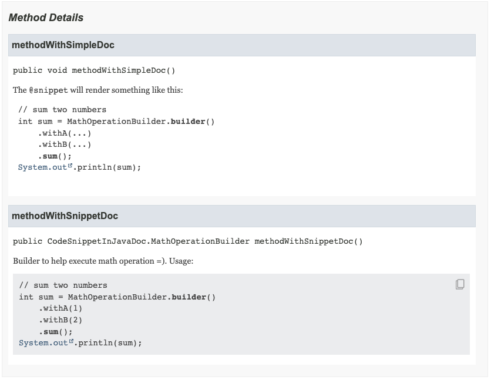

# Java 18

To run each example use: `java --enable-preview --source 18 <FileName.java>`

## JEPs

* [400](https://openjdk.java.net/jeps/400) - UTF-8 by Default
* [408](https://openjdk.java.net/jeps/408) - Simple Web Server
* [413](https://openjdk.java.net/jeps/413) - Code Snippets in Java API Documentation
* [416](https://openjdk.java.net/jeps/416) - Reimplement Code Reflection with Method Handles
* [417](https://openjdk.java.net/jeps/417) - Vector API (Third Incubator)
* [418](https://openjdk.java.net/jeps/418) - Internet-Address Resolution SPI
* [419](https://openjdk.java.net/jeps/419) - Foreign Function & Memory API (Second Incubator)
* [420](https://openjdk.java.net/jeps/420) - Pattern matching for `switch` (Second Preview)
* [421](https://openjdk.java.net/jeps/421) - Deprecate Finalization for Removal

## Features

### Language

* chartset UTF-8 will be default for all O.S.
  * to see which is default: `java -XshowSettings:properties -version 2>&1 | grep file.encoding`
  * we can change the chartset with property: `-Dfile.encoding=UTF-8`
  * affected classes:
    * Stream Reader and Writer
    * File Reader and Writer
    * `Formatter` and `Scanner`
    * `URLEncoder` and `URLDecoder`
  * the `System.out` and `System.err` will use the same charset from the terminal
      * we can see with: `Console.charset()`
* Pattern matching for `switch`
  * Minor improvements from JDK 17:
    * refined to use dominance checking that will force constant case label to appear before a guarded pattern of the same type;
    * exhaustiveness checking is now more precise with sealed hierarchies.
* Code snippet in Java Doc
  * was introduced the `@snippet` tag to help write code fragments in Java docs
  * the goals is to provide a way to get this fragments (so it can be validated by other tool), enable syntax highlighting and provide better IDE support
  * code snippet suports:
    * attributes (key-pair values like `usage="sort"`)
    * ID to be referred in others snippets (through `id` attribute)
    * language definition (through `lang` attribute) - default is java
    * external files (through `file` attribute) - using external file to define the snippets allow us to use everything that Java supports (like comments with `/** */`)
  * we can pass `--snippet-path` to `javadoc` tool to define the folders for external snippets
  * example:
    * 

### JVM

* Reimplemented code reflection to use Method Handles

## Links

* [JDK 18 Jeps](https://openjdk.java.net/projects/jdk/18/)
