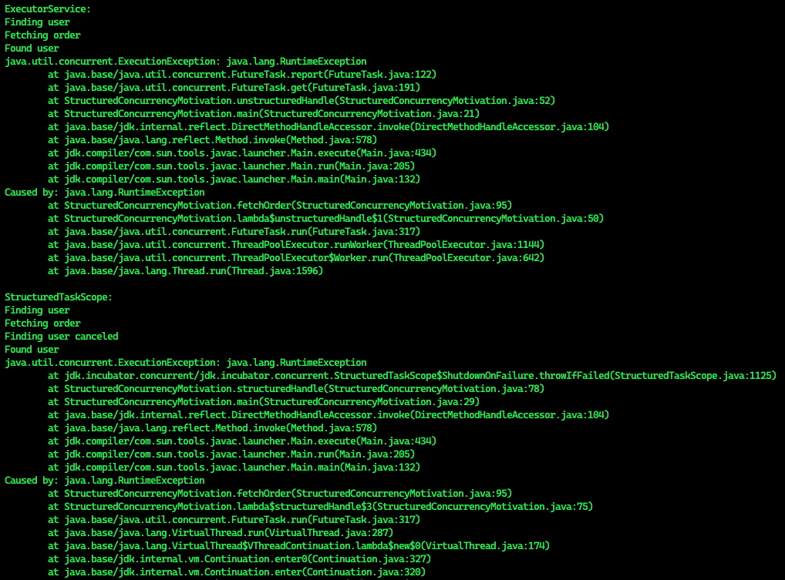
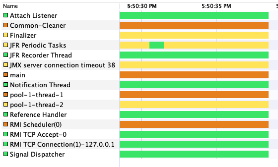
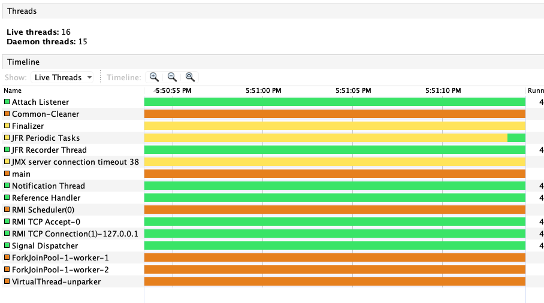

# Example of Structured Concurrency

The output that we can see that the `StructuredTaskScope` canceled other subtask (throwing a `InterruptedException`):

Thread view of concurrency using `ExecutorService`:

Thread view of concurency using `StructuredTaskScope`:

We can not the virtual thread running with ForkJoinPool.
