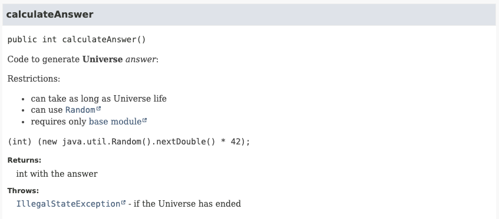

# Java 23

To run each example use: `java --enable-preview --source 23 <FileName.java>`

## JEPs

* [455](https://openjdk.org/jeps/455) - Primitive Types in Patterns, instanceof, and switch (Preview)
* [466](https://openjdk.org/jeps/466) - Class-File API (Second Preview)
* [467](https://openjdk.org/jeps/467) - Markdown Documentation Comments
* [469](https://openjdk.org/jeps/469) - Vector API (Eighth Incubator)
* [471](https://openjdk.org/jeps/471) - Deprecate the Memory-Access Methods in sun.misc.Unsafe for Removal
* [473](https://openjdk.org/jeps/473) - Stream Gatherers (Second Preview)
* [474](https://openjdk.org/jeps/474) - ZGC: Generational Mode by Default
* [476](https://openjdk.org/jeps/476) - Module Import Declarations (Preview)
* [477](https://openjdk.org/jeps/477) - Implicitly Declared Classes and Instance Main Methods (Third Preview)
* [480](https://openjdk.org/jeps/480) - Structured Concurrency (Third Preview)
* [481](https://openjdk.org/jeps/481) - Scoped Values (Third Preview)
* [482](https://openjdk.org/jeps/482) - Flexible Constructor Bodies (Second Preview)

## Features

* **Primitive Types in Patterns, instance of and switch**
    * goal: "enhance pattern matching by allowing primitive type patterns in all pattern contexts"
    * in JDK 21, primitive type patterns are allowed only as nested patterns in record pattern (e.g.: `v instanceof JsonNumber(double d)`)
    * this JEP will:
        * extend pattern matching to allow primitive type patterns in all places (e.g.: `v instanceof JsonNumber(int i)`);
        * enhance `instanceof` and `switch` to support primitive type patterns as top level pattern
        * enhance `instanceof` to check the primitive type, beside the reference type checking, and also verify the primitive support value:
            * allowing to do an implicity cast during matching if, and only if, there is no loss of information (exact conversion)
            * e.g.: if an `int` is to large for a `byte` it will not be matched
            * `instanceof` will be used as safeguard for all conversions
            * in [JLS §5.5](https://docs.oracle.com/javase/specs/jls/se21/html/jls-5.html#jls-5.5-320) we can see the permited conversions
        * enhance the `switch` to works with literals of all primitive types:
            * until JDK 21, `boolean`, `float`, `double` and `long` cannot be used as case value
            * switch will be exhaustive if it contains a unconditional type pattern
                * an `int` is always a `long`, so a label `case long l` will match any integer
            * switch and floating-points:
                * if the switch's selector expression is a float then any case constants must be a floating-point literals
                * floating-point literal in case labels is defined in terms of [representation equivalence](https://docs.oracle.com/en/java/javase/21/docs/api/java.base/java/lang/Double.html#repEquivalence)
                    * a label `case 1.0f` is considered the same as `case 0.99999999f`, will throw a duplicate label error
* **Markdown Documentation Comments**
    * allow JavaDoc to be written using Markdown
    * will be easy to write and read in text editors
    * support to HTML elements and JavaDoc tags will still be provided
    * Java Compiler API will support links and code analysis inside Markdown
    * to use Markdown comments we need to use `///` in each line instead of block comment `/** */`
    * `///` were used because `/*` has some limitations:
        * `*/` cannot be used in comments
        * the use of ` *` in each line inside the block is optional, could conflict with Markdown item listing `*`
    * syntax supported is a Markdown variation called [CommonMark](https://spec.commonmark.org/0.30/)
    * usage:
        * we can link using `[]` with the Java reference inside:
            * module: `[java.base/]`
            * package: `[java.util]`
            * class: `[String]`
            * field: `[String#CASE_INSENSITIVE_ORDER]`
            * method: `[String#chars()]`
            * alternative text: `[String method chars][String#chars()]`
        * table syntax in the same as Github Markdown
        * we can use JavaDoc tags normally (like `@param`, `@return`, `@throws`, `@inheritDoc`)
    * we can add scripts in `javadoc` to enable syntax highlighting and mermeid diagramas
    * example:
        * code:
        ```java
        /// Code to generate **Universe** _answer_:
        ///
        /// Restrictions:
        ///
        /// - can take as long as Universe life
        /// - can use [java.util.Random]
        /// - requires only [base module][java.base/]
        ///
        /// `return (int) (new java.util.Random().randomInt().nextDouble() * 42);`
        ///
        /// @return int with the answer
        /// @throws IllegalStateException if the Universe has ended
        public int calculateAnswer() {
            return (int) (new java.util.Random().nextDouble() * 42);
        }
        ```
        * renderization:
        
* **Stream Gatherers**
    * re-preview without change
* **Deprecate the Memory-Access Methods in `Unsafe` for Removal**
    * deprecated for future removal
    * we should use VarHandle API and FFM API
    * we can use command line option `--sun-misc-unsafe-memory-access` with `allow`, `warn` or `deny` to customize th JVM behavior
* **ZGC: Generational Mode by Default**
    * switch the default mode of ZGC to use generational mode
    * deprecate the non-generational mode to be removed in the future
        * reduce the maintenance cost of supporting two models
    * default mode will act like using command-line args: `-XX:+UseZGC -XX:+ZGenerational`
    * non-generational can still be used with: `-XX:+UseZGC -XX:-ZGenerational`
    * Generational ZSG should be a better solution for most use cases
* **Module Import Declarations**
    * allow import all packages exported by a module
    * goal is simplify the learning and exploring of APIs without having to know its exactly package
    * when importing a module, it will automatically import all its exported packages and its transitive dependencies
    * syntax:
        * `import module [Module Name]`
        * `import module java.sql`
    * ambiguous import:
        * in case of two module exporting the same class name, we will have to import the class directly
        * ```java
          import module java.base; // java.util.Date
          import module java.sql; // java.sql.Date
          import java.sql.Date;
          ```
* **Implicitly Declared Classes and Instance Main Methods**
    * major change from JDK 21 and 22
    * implicitly import methods from a new class `java.io.IO`
        * new class created for convenience IO
        * provides methods: `print(Object)`, `println(Object)` and `readln(String)`
        * this class uses return from `System.console()` to print and read from the default input and output streams
    * implicitly class will automatically import all of the public top-level classes and interfaces from module `java.base`
* **Structured Concurrency**
    * re-preview without change
* **Scoped Values**
    * re-preview with one change from JDK 22
    * the type of the parameter of the `ScopedValue.callWhere` method is now a new functional interface
        * functional interface: `ScopedValue.CallableOp<T, X extends Throwable>`
    * this will allow Java compiler to infer whether a checked exception might be thrown
    * the method `ScopedValue.getWhere` is no longer needed and is removed
    * this will simplify the usage where exception can also be thrown
* **Flexible Constructor Bodies**
    * new name after JEP 447: Statements before `super` (preview)
    * changed from JDK 22 to allow initialize fields in the same class before explicitly invoking a constructor
    * this will allow a superclass never executes code with use subclass values with their default value (`0`, `false` or `null`)

## Links

* [JDK 23 - JEP Dashboard](https://bugs.openjdk.org/secure/Dashboard.jspa?selectPageId=22205)
* [JDK 23 JEPs](https://openjdk.org/projects/jdk/23/)
* [All Java 23 Features - Inside Java Newcast](https://www.youtube.com/watch?v=kzjGp7LmW0I)

