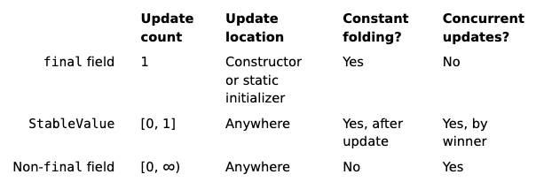

# Java 25

To run each example use: `java --enable-preview --source 25 <FileName.java>`

## JEPs

* [470](https://openjdk.org/jeps/470) - PEM Encodings of Cryptographic Objects (Preview)
* [502](https://openjdk.org/jeps/502) - Stable Values (Preview)
* [503](https://openjdk.org/jeps/503) - Remove the 32-bit x86 Port
* [505](https://openjdk.org/jeps/505) - Structured Concurrency (Fifth Preview)
* [506](https://openjdk.org/jeps/506) - Scoped Values
* [507](https://openjdk.org/jeps/507) - Primitive Types in Patterns, instanceof, and switch (Third Preview)
* [508](https://openjdk.org/jeps/508) - Vector API (Tenth Incubator)
* [509](https://openjdk.org/jeps/509) - JFR CPU-Time Profiling (Experimental)
* [510](https://openjdk.org/jeps/510) - Key Derivation Function API
* [511](https://openjdk.org/jeps/511) - Module Import Declarations
* [512](https://openjdk.org/jeps/512) - Compact Source Files and Instance Main Methods
* [513](https://openjdk.org/jeps/513) - Flexible Constructor Bodies
* [514](https://openjdk.org/jeps/514) - Ahead-of-Time Command-Line Ergonomics
* [515](https://openjdk.org/jeps/515) - Ahead-of-Time Method Profiling
* [518](https://openjdk.org/jeps/518) - JFR Cooperative Sampling
* [519](https://openjdk.org/jeps/519) - Compact Object Headers
* [520](https://openjdk.org/jeps/520) - JFR Method Timing & Tracing
* [521](https://openjdk.org/jeps/521) - Generational Shenandoah

## Features

* **Stable Values**
    * introduce a API for stable values
    * stable value is an object that hold immutable data
        * the data that it holds is called content
    * is treated as constants by the JVM (allowing performance optimiziations)
    * is more flexible than final field by allowing different timing for initialization, enabling lazyness
    * aims deferred immutability
        * initialize the field when it is used with a value that is computed at most once and safely multi-threaded
    * goals:
        * improve the startup of applications by breaking up the monolithic initialization state
        * decouple the creation of stable values from the initialization, without significant performance penalties
        * guarantee that stable value is initialized at most once, even in multi-threading
        * enable use code to safely use constant-folding optimizations previously available only to JDK internal code
    * final fields have some restrictions:
        * must be set eagerly (during class constructor ou class initialization for static fields)
        * the order in which final fields are initialized is determined by the textual order in which the fields are declared
    * example of a expensive final field with expensive initialization (might parse logging configuration):
        * ```java
          public class OrderController {
              private static final Logger logger = Logger.create(OrderController.class);
          }
          ```
    * comparing stable values x final field x mutable field:
        * 
    * stable value is instance of class [StableValue<T>](https://cr.openjdk.org/~pminborg/stable-values2/api/java.base/java/lang/StableValue.html)
        * `stable value must be initialized some time before its content is first retrieved and it is immutable thereafter`
        * under the hood, the content of a stable value is stored in a non-final field annotated with the JDK-internal [`@Stable`](https://github.com/openjdk/jdk/blob/master/src/java.base/share/classes/jdk/internal/vm/annotation/Stable.java) annotation
        *
          ```
          It asserts that, even though the field is non-final, the JVM can trust that the field’s value will not change after the field’s initial and only update.
          This allows the JVM to treat the content of a stable value as a constant, provided that the field which refers to the stable value is final.
          Thus the JVM can perform constant-folding optimizations for code that accesses immutable data through multiple levels of stable values.
          ```
    * stable value, stable supplier and stable list:
        * stable value:
            * we need to declare the field with static factory that returns an unset stable value (holds no content)
                * `final StableValue<Logger> logger = StableValue.of()`
                * we can also create a pre-set stable value:
                    * `final StableValue<Logger> logger = StableValue.of(Logger.create(MyClass.class))`
            * to read the content we can use some read methods that have different intents:
                * initialize the stable value if it is unset:
                    * `logger.orElseSet(() -> Logger.create(MyClass.class))`
                    * if the value is unset, the stable value is initialized by the given `Supplier<T>`
                    * if the value is already set, it returns the actual content
                    * guarantees that the value is initialized before it is used
                * use the set content or use a given value:
                    * `logger.orElse(someOtherLogger)`
                * use set content or throw an `NoSuchElementException`:
                    * `logger.orElseThrow()`
            * example:
                ```java
                public class OrderController {
                    private final StableValue<Logger> logger = StableValue.of();

                    private Logger getLogger() {
                        return logger.orElseSet(() -> Logger.create(OrderController.class));
                    }

                    public void placeOrder() {
                        getLogger().log("Placing order...");
                    }
                }
                ```
        * stable supplier:
            * we also can declare the stable supplier (without needing a getter method):
                * `final Supplier<Logger> logger = StableValue.supplier(() -> Logger.create(MyClass.class))`
                * here we can declare and define the supplier for the stable value
                * the stable value will be initialized at the first call to `StableValue.get` method
            * example:
                ```java
                public class OrderController {
                    private final Supplier<Logger> logger = StableValue.supplier(() -> Logger.create(OrderController.class));

                    public void placeOrder() {
                        logger.get().log("Placing order...");
                    }
                }
                ```
        * stable collection
            * stable collection is a unmodifiable collection (list or map) that is backed by stable values
            * each element is a stable value that is initialized at most once by demand
            * stable list:
                * each index is initialized when it is need by the `get(index)` method
                * ```
                  Stable lists retain many of the benefits of stable suppliers, since the function used to initialize the list's elements is provided when defining the list.
                  The JVM can, as usual, perform constant-folding optimizations on code that accesses the content of stable values through stable lists.
                  ```
                * we can declare a stable list with factory method `StableValue.list<T>(int size, IntFunction<T> mapper)`:
                    * `static final List<MyClass> MY_CLASSES = StableValue.list(10, _ -> new MyClass())`
                    * the factory method creates an internal implementation of `List<T>` that initializes the stable values when they are read
                * to read a content we use `get(index)`:
                    * `MY_CLASSES.get(1)`
            * stable map:
                * it is an unmodifiable map whose keys are known at construction
                * each entry is initialized when it is needed by the `get(key)` method
                * we can declare a stable map with factory method `StableValue.map<K,V>(Set<K> keys, Function<K,V> mapper)`:
                    * `static final Map<String, MyClass> MY_CLASSES = StableValue.map(Set.of("one", "two", "three"), _ -> new MyClass())`
                * to read a content we use `get(key)`:
                    * `MY_CLASSES.get("one")`
                    * if the given key was not in set used in the construction an exception will be thrown
    * the full [performance](https://cr.openjdk.org/~pminborg/stable-values2/api/java.base/java/lang/StableValue.html#performance) can be achieved by using static final fields:
        * the core reflaction API allows instance final fields to be [updated arbitrarily](https://docs.oracle.com/en/java/javase/23/docs/api/java.base/java/lang/reflect/AccessibleObject.html#setAccessible(boolean))
        * this will be improved with [integrity by default](https://openjdk.org/jeps/8305968)
* **Primitive Types in Patterns, instanceof and switch**
    * re-preview without change
* **Structured Concurrency**
    * re-preview with several API changes
    * previous changes in [JDK 19](../java-19/README.md) and [JDK 21](../java-21/README.md)
    * Joiners:
        * introduce the concept of execution policy with `Joiner`
        * Joiner object handles subtask completion and produces the outcome for the `join()` method
        * depending on the joiner, the `join()` method may return a result, a stream of elements, or some other object
        * the result of `join()` is useful when we don't handle each subtask individually, rather we want to wait for all subtasks to finish and then process the results (first result or all)
        * a joiner instance should never be reused, always create a new instance
    * `StructuredTaskScope` is open using static factory methods:
        * `open()`: creates a scope with joiner strategy default of `StructuredTaskScope.Joiner.allSuccessfulOrThrow()` but `join()` will return null
        * `open(StructuredTaskScope.Joiner)`: creates a scope with the specified joiner strategy
        * `open(StructuredTaskScope.Joiner, Function)`: creates a scope with the specified joiner strategy and a function to customize the default configuration of the execution (name, thread factory and timeout)
    * the scope can now be configured with a instance of [`Config`](https://download.java.net/java/early_access/loom/docs/api/java.base/java/util/concurrent/StructuredTaskScope.Config.html):
        * `withName(String)`: sets the name of the scope to be monitored and managed
        * `withThreadFactory(ThreadFactory)`: sets the thread factory to use for each subtask
        * `withTimeout(Duration)`: sets the timeout for the scope, should use `Instant` to calculates the deadline (`Duration.between(Instant.now(), deadline)`)
    * `Joiner` interface declares factory methods to create joiners for some common cases:
        * interface:
            ```java
            public interface Joiner<T, R> {
                public default boolean onFork(Subtask<? extends T> subtask);
                public default boolean onComplete(Subtask<? extends T> subtask);
                public R result() throws Throwable;
            }
            ```
        * factory methods for default policies:
            * `allSuccessfulOrThrow`:
                * waits for all tasks to complete successfully or throws an exception if any subtask fails
                * `join()` will return a stream of `Subtask` that yields the subtask results in the order they are completed
                * useful when all subtasks return a result of same type and we want to process them all
            * `anySuccessfulResultOrThrow`:
                * waits for any subtask to complete successfully or throws an exception if all tasks fail
                * `join()` will return the result of a successful subtask
                * useful when we want to process the result of the first successful subtask
            * `awaitAllSuccessfulOrThrow()`:
                * waits for all tasks to complete successfully or throws an exception if any subtask fails
                * `join()` returns `Void`
                * useful when the subtasks return a result of different types and we process each subtask submitted with `fork` method individually
            * `awaitAll`:
                * waits for all tasks to complete, regardless of success or failure
                * `join()` returns `Void`
                * useful when the subtasks make use of side effects operations and don't return a result or exception
                * each subtask will yield the result or exception of its execution
            * `allUntil(Predicate)`
                * waits all subtasks are completed or the predicate is satisfied to cancel the scope
                * `join()` returns stream of all subtasks in the order they were forked
                    * each subtask can have the following states: `SUCCESS`, `FAILURE` or `UNAVAILABLE` (if the scope has been cancelled before it were forked or completed)
                * predicate is an instance of [`Predicate<StructuredTaskScope.Subtask<? extends T>>`](https://download.java.net/java/early_access/loom/docs/api/java.base/java/util/function/Predicate.html)
                * each subtask that is completed successfully or failed will be passed to the predicate
                    * if the predicate returns true, the scope will be cancelled
                    * if throws an exception, `Thread.UncaughtExceptionHandler.uncaughtException` will be called
    * we can implement our own joiner by implementing the interface `StructuredTaskScope.Joiner`
        * we can implement the method `join` to return a result of type `R` and the method `onCompletion` to handle the completion of each subtask
    * change in thread-dump to show virtual threads used by a `StructuredTaskScope`
        * `jcmd <pid> Thread.dump_to_file -format=json <file>`
* **Scoped Values**
    * promotion to standard with minor change
        * `ScopedValue.orElse` method no longer accepts null as its argument
    * enable the sharing of immutable data within a thread and its child threads
    * it were inspired by the way that Lisp dialects provide support for dyanamically scoped free variables
    * they are preferred to thread-local variables (specially when using virtual threads)
    * goals:
        * provide a programming model to share data both within a thread and with child threads
        * make the lifetime of shared data visible from structure of code
        * ensure that data shared by a caller can be retrieved only by legitimate callees
        * thread shared data as immuatable so as to allow sharing by a large number of threads and to enable runtime otimiziations
    * problems with thread-local variables:
        * mutability: any object can update the variable if it has access to it
        * unbounded lifetime: it is stored until the thread is destroyed, if is used in a pool it can take a long time
        * expensive inheritance: a child thread must allocate memory for every variable stored in the parent thread
    * a scoped value allows data to be safely and efficiently shared between threads within same hierarchy
        * `scoped value is a container object that allows a data value to be safely and efficiently shared by a method with its direct and indirect callees within the same thread, and with child threads, without resorting to method parameters`
    * ScopedValue API works by executing a method with a `ScopedValue` object bound to some value for the bounded period of execution of a method
    * we use an attribute of type [`ScopedValue`](https://download.java.net/java/early_access/loom/docs/api/java.base/java/lang/ScopedValue.html) declared as final static
        * scoped value has multiple values associated with it, one per thread
        * once the value is written to scoped value it becomes immutable and is available only for a bounded period during execution of that thread insided that scope
    * we can create another scope when inside a scope with another variable to create a new scope
    * we can create nested scope with rebinded value when using the same `ScopedValue` to create a new scope
        * the created scope will have the new value binded
        * the current scope will still have its original value
    * usage:
        * first we need to create a scope key
            * `private static final ScopedValue<String> SCOPE_KEY = ScopedValue.newInstance();`
        * then we use `ScopedValue.where` to bind a value to the scope key
            * `ScopedValue.where(SCOPE_KEY, "my-value")`
            * if we bind a value to a scope key that is already bound, the new value will be used in the current scope (rebinding)
            * we can set multiples values to the same scope by using the same `ScopedValue` in multiple calls to `where`
                * `ScopedValue.where(SCOPE_KEY, "my-value").where(SCOPE_KEY_2, "other-value").run(() -> {})`
        * then use the method `run` or `call` to bind the scoped value with the current thread and the execution scope
            * method `run` is an one-way sharing to the execution scope
                * `run` has parameter of type `Runnable`
            * method `call` allow us to receive a result from the execution scope
                * `call` has parameter of type functional interface: `ScopedValue.CallableOp<T, X extends Throwable>`
                * `call` will return the result of the execution of the lambda expression
        * during the lifetime of the lambda expression (and every method called by it) we can read the scoped value using the method `get`
            * we use scoped key to read: `SCOPE_KEY.get()`
            * `NoSuchElementException` if the scoped value is not bounded
            * we can use `orElse` to set a default value if the scoped value is not bounded
                * `SCOPE_KEY.getOrElse("default-value")`
        * ex.:
            * `run`:
                ```java
                public final static ScopedValue<String> PRINCIPAL = ScopedValue.newInstance();
                ScopedValue.where(PRINCIPAL, "guest")
                    .run(() -> {
                        var userRole = PRINCIPAL.get();
                    });
                ```
            * `call`:
                ```java
                public final static ScopedValue<String> PRINCIPAL = ScopedValue.newInstance();
                var userRole = ScopedValue.where(PRINCIPAL, "guest")
                    .call(() -> {
                        return "Value: " + PRINCIPAL.get();
                    });
                ```
    * virtual thread and cross-thread sharing
        * to share data between a thread and its child thread we need to make the scoped values inherited by child thread
            * we can use the Structured Concurrency API
            * the class `StructuredTaskScope` automatically make the scoped value inherited by child thread
            * the fork must occurrs inside the `ScopedValue` method `run`/`call`
            * the binding will remains until the child thread are finished and we can use `StructuredTaskScoped.join` to ensure that the child threads will terminate before `run`/`call`
        * when we try to access a scoped value not shared with current thread an exception `NoSuchElementException` will be thrown
* **Module Import Declarations**
    * promotion to standard without change
    * allow import all packages exported by a module
    * goal is simplify the learning and exploring of APIs without having to know its exactly package
    * when importing a module, it will automatically import all its exported packages and its transitive dependencies
        * import module `java.se` will import the entire Java SE API
    * syntax:
        * `import module [Module Name]`
        * `import module java.sql`
    * ambiguous import:
        * in case of two module exporting the same class name, we can import the class directly or its package
        * allow any type-import-on-demand declarations to shadow module import declarations
        *
          ```java
          // module imports
          import module java.base; // java.util.Date
          import module java.sql; // java.sql.Date

          // package imports
          import java.util.*; // every class used will shadow the class from module imports

          // single-type imports
          import java.sql.Date; // will shadow all above imports
          ```
* **Compact Source Files and Instance Main Methods**
    * promotion to standard with minor changes
        * changed terminology from "simple source file" to "compact source file"
        * changed package of `IO` to `java.lang.IO`
    * facilitate the writing of first program for students without needing to know another features designed for large programs
    * implicitly declared class:
        * any method declared in a source file without an enclosed class will be considered to be member of an implicitly declared class whose members are unenclosed fields and methods
        * implicitly declared class is always final and cannot implement or extends any class other than `Object`
        * the compiler requires an implicitly declared method to have a launchable main method
        * we cannot use javadoc tool to generate documation from a implicitly declared class (doesn't have a accessible API from other class)
        * is equivalent to the following usage of anonymous class declaration:
            ```java
            new Object() {
                void main() {}
            }.main();
            ```
        * as it doesn't have a name, so we cannot use its static methods using its class name (`ClassName.staticMethodName()`)
        * it still will have the impliticy `this` reference
        * it can have:
            * instance and static methods
            * instance and static fields
            * the default modifers are the same (package access and instance membership)
        * the main difference is will only have an impliticy default zero-paramater constructor and cannot have initializers (static nor instance)
        * implicitly class will automatically import all of the public top-level classes and interfaces from module `java.base`
        * `Class.isSynthetic` method returns true
    * launchable main method:
        * change to how Java programs are launched
        * instance main method:
            * the class must have a non-private zero-paramater constructor
            * the main method doesn't need to be static, public nor have parameter
            * example:
                ```java
                class HelloWord {
                    void main() {
                        System.out.println("Hello World!");
                    }
                }
                ```
        * allowing implicitly declared class:
            ```java
            void main() {
                System.out.println("Hello World!");
            }
            ```
        * order to select a main method (must be non-private and it prioritize the methods in current class before the superclass):
            * `static void main(String[])`
            * `void main(String[])`
            * `static void main()`
            * `void main()`
    * `java.lang.IO`
        * new class created for convenience I/O
        * provides methods: `print(Object)`, `println(Object)`, `println()`, `readln(String)` and `readln()`
        * this class uses return from `System.console()` to print and read from the default input and output streams
        * we can use with: `IO.println("Hello World")`
* **Flexible Constructor Bodies**
    * promotion to standard without change
    * allow statements that do not reference the instance being created to appear before an explicit constructor invocation
    * will allow to use statements that use, transform or verify values before call `super`
    * the code before the `super` lives in pre-construction context:
        * can perform any statements that don't use any member of the instance being created (or its hierarchy or outter/inner classes that depends on the instance)
    * we can:
        * can access static members
        * initialize fields in the same class before explicitly invoking a constructor
            * this will allow a superclass never executes code with use subclass values with their default value (`0`, `false` or `null`)
        * if the class is an inner class, it can access members of its enclosing class (like `Outer.this.field++`)
            * the outer class instance already exists
    * initialization flow:
        ```
        C prologue
        --> B prologue
            --> A prologue
                --> Object constructor body
            --> A epilogue
        --> B epilogue
        C epilogue
        ```
* **Ahead-of-Time Command-Line Ergonomics**
    * simplify the process to create ahead-of-time caches by introducing a new command-line option that will run the record (`AOTMode=record`) and create mode (`AOTMode=create`)
    * introduced the command-line option `AOTCacheOutput` that receives the AOT cache output file
        * this command-line will run each step (record and create mode) for us
    * introduced new environment variable `JDK_AOT_VM_OPTIONS` that can be used to pass command-line options to run with create mode (won't pass to record mode)
        * the syntax is the same as for `JAVA_TOOL_OPTIONS`
    * two-step workflow:
        * record mode:
            ```bash
            java -XX:AOTMode=record -XX:AOTConfiguration=app.aotconf -cp app.jar com.example.App
            ```
        * create mode:
            ```bash
            java -XX:AOTMode=create -XX:AOTConfiguration=app.aotconf -XX:AOTCache=app.aot
            ```
    * one-step workflow:
        ```bash
        java -XX:AOTCache=app.aot -cp app.jar com.example.App
        ```
* **Ahead-of-Time Method Profiling**
    * improve warmup time by making method-execution profiles from a previous run
    * this will enable the JIT compiler to generate native code immediately upon application startup, rather than having to wait for profiles to be collected
    * the only way to really know what the application does is running it
        * one reason for this uncertainly is that, in the absence of final or sealed modifiers, any class can be subclassed at any time
        * another reason is that new classes can be loaded in response to external input
    * [static analysis can always be defeated by program complexity](https://en.wikipedia.org/wiki/Rice's_theorem)
    * AOT cache was extended to collect method profiles during training runs
* **Compact Object Headers**
    * promotion to standard without change
    * reduce the size of object headers in the HotSpot JVM from between 96 and 128 bits to 64 bits on 64-bit architecture
    * goals:
        * reduce object sizes and memory footprint on realistic workloads
        * not introduce more than 5% throughput or latency overheads
    * can be enable with:
        * `-XX:+UseCompactObjectHeaders`
* **Generational Shenandoah**
    * promotion to standard without change
    * Shenandoah is a low-pause-time garbage collector
    * enhance the Shenandoah GC to use a generational approach to improve sustainable throughput, load-spike resilience, and memory utilization
    * goals relative to non-generational Shenandoah:
        * reduce sustained memory footprint without sacrificing low GC pauses
        * reduce CPU and power usage
        * decrease the risk of incurring degenerated and full collections during allocation spikes
        * sustain high throughput
        * continue to support compressed object pointers
        * initially support x64 and AArch64
    * command-line options to use generational Shenandoah:
        ```bash
        java -XX:+UseShenandoahGC -XX:ShenandoahGCMode=generational
        ```

## Links

* [JDK 25 - JEP Dashboard](https://bugs.openjdk.org/secure/Dashboard.jspa?selectPageId=23200)
* [JDK 25 JEPs](https://openjdk.org/projects/jdk/25/)
* [Java 25 Brings 18 JEPs - Inside Java Newscast #92](https://www.youtube.com/watch?v=T5q72vcSjyk)
* [How to Upgrade to Java 25](https://youtu.be/9azNjz7s1Ck?si=J1LPBZG1uManLu4-)

